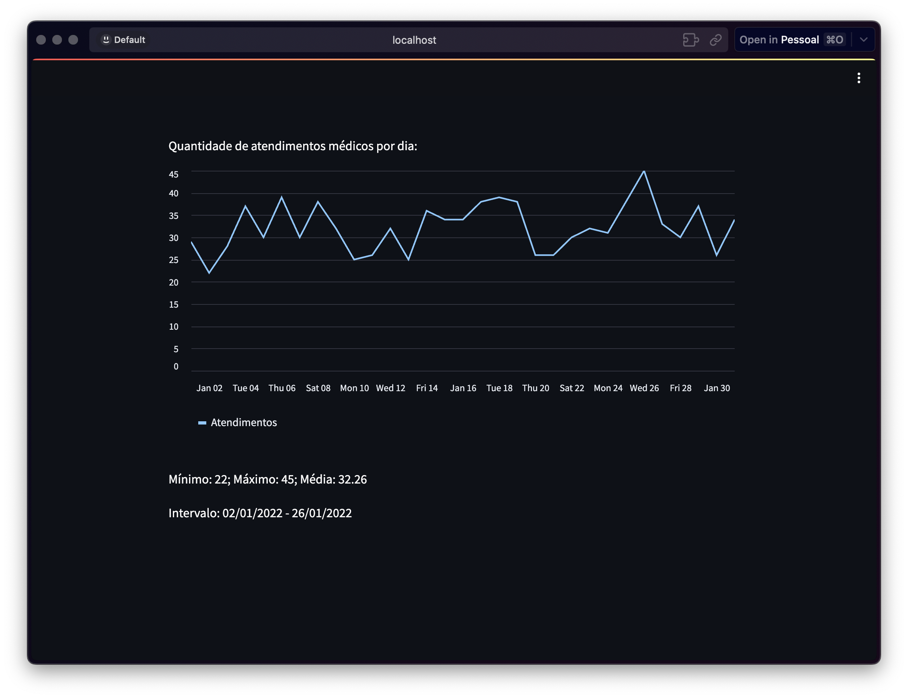

# Desafio de Processo Seletivo - Área de Dados

Olá, pessoal! Este é o meu repositório contendo a resolução do desafio proposto para o processo seletivo na área de dados. Aqui, apresento minha abordagem sobre o problema proposto.

## Introdução

Os problemas consistem em coletar, processar e carregar volumes de dados a fim de testar minhas habilidades sobre problemas frequentes do dia a dia.

## Dependências

Aqui estão listadas as tecnologias utilizadas no projeto anexadas ao seu link de instalação. É necessária a instalação para que os programas sejam executados corretamente.

- [Python](https://www.python.org/downloads/)

- SQL

- PostgreSQL

- [Docker](https://www.docker.com/)

- [Psycopg2](https://www.psycopg.org/docs/install.html#quick-install)

- [Pandas](https://pandas.pydata.org/docs/getting_started/install.html#installing-from-pypi)

- [streamlit](https://streamlit.io/) (Visualização)

> **Nota:** É importante destacar que SQL é uma linguagem de consulta que é executada no SGBD (Sistema gerenciador de banco de dados) como PostgreSQL, por isso não precisa de instalação. Já o PostgreSQL é instalado automaticamente pelo docker, por isso não precisa de instalação. As outras tecnologias precisam de suas devidas instalações.

### Python

## Estrutura do Repositório

Aqui vai uma breve explicação sobre cada aquivo no desafio.

```
/
|-- assets/images		# Prints de exemplos de visualização
|-- data/				# Exemplos de dados de entrada para os problemas
|-- problems/       	# Resposta para cada problema
|-- README.md   		# Documentação do projeto (este arquivo)
|-- setup/      		# Criação do contexto do problema
|-- docker-compose.yml  # Configuração do docker
```

## Instruções para Execução

### Consultas em SQL

É possível testar as consultas escritas em **SQL** facilmente utilizando o [Docker](https://www.docker.com/).

1.  Após a instalação do Docker, rodar o comando abaixo:

```
$ docker compose up -d
```

2.  Entrar no link [localhost:8080](http://localhost:8080/).
3.  Fazer o login com as credencias:

```
> System: PostgreSQL
> Username: postgres
> Password: postgres
> Database: stg_hospital
```

4.  Agora é só clicar na opção `SQL command` na parte superior esquerda e rodas as consultar em SQL.

> **Nota**: Criei algumas consultas dentro o diretório `/setup` para facilitar os testes dos problemas.

### Scripts em Python

Para cada script em python eu crie um mock no diretório `/data` na root do projeto. Dessa forma, é possível ser testado apenas executando o arquivo.

```
$ python3 problem_<x: numero>.py
```

### Visualização

Com relação à visualização, decidi utilizar o framework **streamlit**, por sua facilidade de implementação de componentes visuais e pela ótima integração com Python, o que possibilitou a utilização da biblioteca **Pandas**, super poderosa na manipulação de dados. Dessa forma, é possível trazer métricas e insights materializados em painéis de forma ágil, o que facilita o suporte a tomada de decisão.

Para executar o problema 10 é simples é rápido.

1. Instalar o framework streamlit com o comando caso não tenha instalado:

```
$ pip install streamlit
```

2. No terminal, executar o stremlit com o comando:

```
$ cd problems/
$ streamlit run problem_10.py
```

Pronto! Uma janela é aberta com os painéis e a mágica acontece.



## Próximos Passos

Devido ao escopo de tempo limitado nem tudo é possível ser feito, porém, vou listar aqui minha ideias de possíveis melhorias que poderiam ser feitas.

- No problema 5 e 6: Adicionar a funcionalidade de criar os relacionamentos do SIGTAP
- No problema 5 e 6: Criar testes para verificar se os dados foram registrados da forma correta
- No problema 5 e 6: Criar rotina para baixar automaticamente as competências do SIGTAP e atualizar o banco
- No problema 5 e 6: Lidar com falha de segurança cibernética, uma vez que é executada uma string criada diretamente lida de um arquivo (SQL Injection)
- No problema 10: Utilizar os dados importados do SIGTAP
- No problema 10: Configurar o deploy para que os analistas tenham acesso a página

## Contato

Caso tenha alguma dúvida, feedback ou interesse em entrar em contato comigo, sinta-se à vontade para enviar um e-mail para: mauriciosightman@gmail.com.

---

Agradeço pela oportunidade de participar deste processo seletivo e espero que este repositório demonstre meu entusiasmo e habilidades na área de dados. Estou ansioso para receber seu feedback e discutir mais sobre a solução apresentada.

Obrigado!

Maurício Sightman
mauriciosightman@gmail.com
[LinkedIn](www.linkedin.com/in/mauricio-sightman-a74759212)
