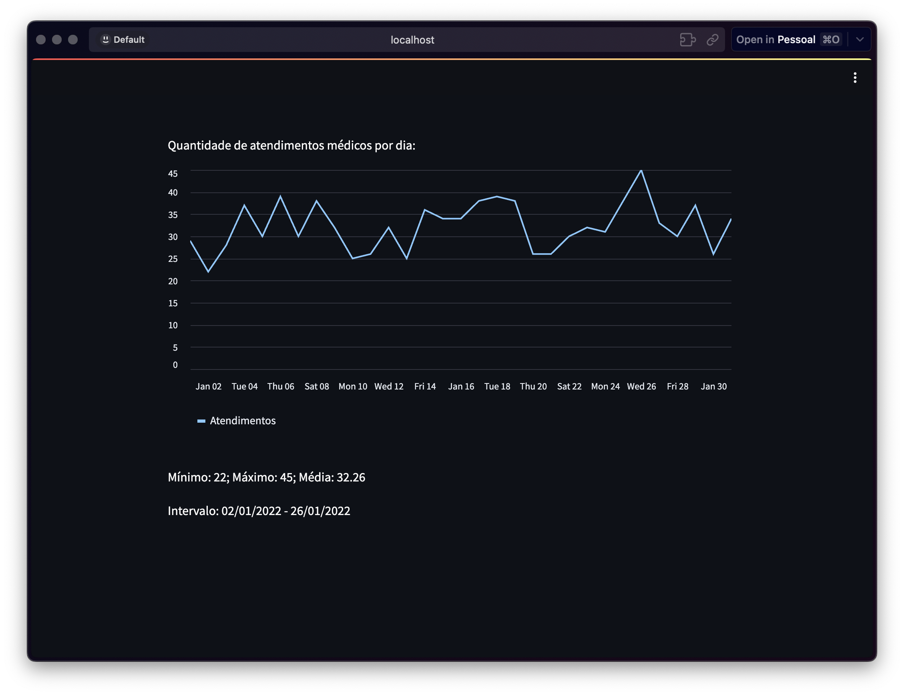

# Desafio de Processo Seletivo - Área de Dados

Olá, pessoal! Este é o meu repositório contendo a resolução do desafio proposto para o processo seletivo na área de dados. Aqui, apresento minha abordagem sobre o problema proposto. 

## Introdução

Os problemas consistem em coletar, processar e carregar volumes de dados a fim de testar minhas habilidades sobre problemas frequentes do dia a dia. 

## Dependências
As tecnologias utilizadas no projeto foram:

- Python
- SQL
- PostgreSQL
- Docker
- Psycopg2
- Pandas
- [streamlit](https://streamlit.io/) (Visualização)

## Estrutura do Repositório

Aqui vai uma breve explicação sobre cada aquivo no desafio.

```
/ 
|-- assets/images 						# Prints de exemplos de visualização
|-- data/ 								# Exemplos de dados de entrada para os problemas
|-- problemas/ 							# Resposta para cada problema 
|-- README.md 							# Documentação do projeto (este arquivo) 
|-- setup/ 								# Criação do contexto do problema
|-- docker-compose.yml 					# Configuração do docker
```

## Instruções para Execução

### Consultas em SQL
É possível testar as consultas escritas em **SQL** facilmente utilizando o [Docker](https://www.docker.com/).
 1. Após a instalação do Docker, rodar o comando abaixo:
 ```
$ docker compose up -d
 ```
 2. Entrar no link [localhost:8080](http://localhost:8080/).
 3. Fazer o login com as credencias:
 ```
> System: PostgreSQL
> Username: postgres
> Password: postgres
> Database: stg_hospital
 ```
 4. Agora é só clicar na opção `SQL command` na parte superior esquerda e rodas as consultar em SQL. 

> **Nota**: Criei algumas consultas dentro o diretório `/setup` para facilitar os testes dos problemas.

### Scripts em Python
Para cada script em python eu crie um mock no diretório `/data` na root do projeto. Dessa forma, é possível ser testado apenas executando o arquivo.
```
$ python3 problema<x: numero>.py
```

### Visualização
Com relação à visualização, decidi utilizar o framework **streamlit**, por sua facilidade de implementação de componentes visuais e pela ótima integração com Python, o que possibilitou a utilização da biblioteca **Pandas**, super poderosa na manipulação de dados. Dessa forma, é possível trazer métricas e insights materializados em painéis de forma ágil, o que facilita o suporte a tomada de decisão.

Para executar o problema 10 é simples é rápido.
1. Instalar o framework streamlit com o comando:
```
$ pip install streamlit
```
2. No terminal, executar o stremlit com o comando:
```
$ cd problemas/
$ streamlit run problema10.py
```

Pronto! Uma janela é aberta com os painéis e a mágica acontece.



## Contato

Caso tenha alguma dúvida, feedback ou interesse em entrar em contato comigo, sinta-se à vontade para enviar um e-mail para: mauriciosightman@gmail.com.

----------

Agradeço pela oportunidade de participar deste processo seletivo e espero que este repositório demonstre meu entusiasmo e habilidades na área de dados. Estou ansioso para receber seu feedback e discutir mais sobre a solução apresentada.

Obrigado!

Maurício Sightman
mauriciosightman@gmail.com
[LinkedIn](www.linkedin.com/in/mauricio-sightman-a74759212)